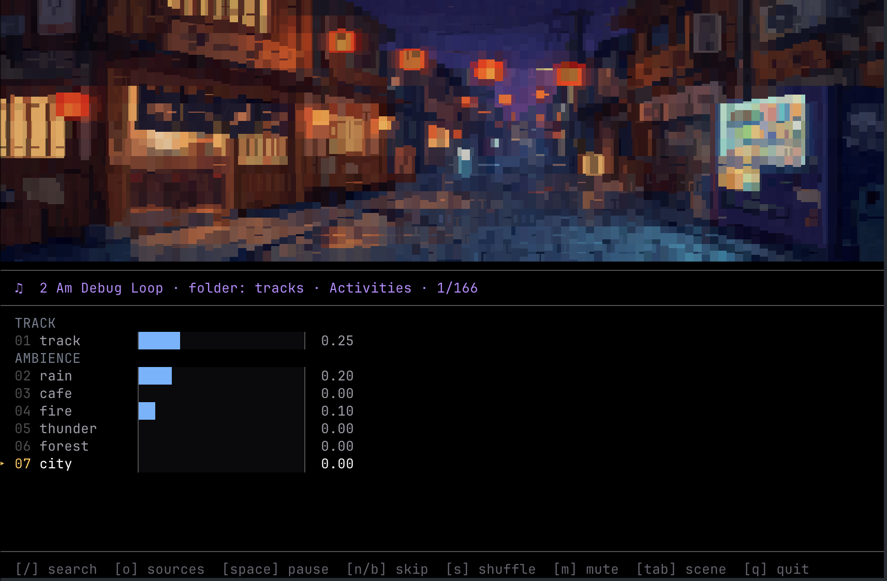

# Musicli

### *A simple music player in your terminal*



> Open your terminal. Set the mood. Stay in flow.
>
> `musicli` is a keyboard-first music player for local folders and stream URLs, with scene visuals, long-form ambience loops, and in-terminal search.

[Why Musicli](#why-musicli) · [Quick Start](#quick-start) · [Use It](#use-it) · [Controls](#controls) · [Presets](#presets) · [Library](#library) · [Development](#development)

---

## Why Musicli

- Full-screen terminal playback built for long focus sessions, not playlist management overhead.
- Live ambience mixing with six long-session layers: `rain`, `cafe`, `fire`, `thunder`, `forest`, and `city`.
- `Track` volume starts at `0.25` on first run and remembers the last level you used.
- Search that stays in the terminal and does not interrupt playback.
- Scene-driven visuals with a portable renderer by default and a sharper `chafa` path when available.
- One source manager for local folders, saved streams, and recent one-offs.
- Local-folder-first onboarding with a native folder picker on supported systems.
- A catalog-first music library with installable packs, ready for a standalone library repo or release assets.

`musicli` is not trying to be a generic music app in a terminal. The point is atmosphere with very little friction.

---

## Quick Start

### Requirements

- `Node.js 22+`
- `ffmpeg` required for playback
- `chafa` optional, recommended for better scene detail
- `yt-dlp` optional, only needed for YouTube URLs passed to `--url`
- Native folder picker support:
  - macOS: built-in through `osascript`
  - Linux: `zenity` or `kdialog` recommended

Example dependency install:

```bash
brew install ffmpeg chafa yt-dlp
# or
sudo apt install ffmpeg chafa zenity
```

### Run From Source

```bash
git clone https://github.com/btahir/musicli.git
cd musicli
npm install
npm run dev
```

### Run the Built CLI

```bash
npm run build
node dist/index.js
```

### Install As a Package

```bash
npm install -g @bilalpm/musicli
musicli
```

If you installed Musicli with npm, you can update it in place later with:

```bash
musicli update
```

### First Session

```bash
musicli
musicli --folder ~/Music/Lofi
musicli --url https://www.youtube.com/watch?v=jfKfPfyJRdk
```

On first run, `musicli` opens an idle welcome screen. After you choose a local folder or stream, Musicli remembers the last source and starts there automatically next time. Use `--home` anytime to reopen the welcome screen on launch.

---

## Use It

### Start Listening

```bash
musicli
musicli --preset chill
musicli --preset jazz
musicli --preset snow
musicli --home
```

On first launch, running `musicli` with no source starts idle and opens a welcome screen. After that, Musicli resumes the last source you used unless you pass `--home`.

- `Local Folder` is the default path.
- On macOS, Musicli opens the system folder picker so you can choose music without typing the path.
- On Linux, it uses `zenity` or `kdialog` when available.
- If no native picker is available, Musicli falls back to the in-terminal path editor.
- If you already know the source, `--folder` and `--url` skip onboarding and go straight in.

### Shape the Room

```bash
musicli --rain 0.40 --city 0.20
musicli --forest 0.50
musicli --fire 0.25 --cafe 0.20
musicli --scene alley
musicli --scene-renderer chafa
```

The `Track` row starts at `0.25` on first run. After that, Musicli remembers the last `Track` level you used in `~/.musicli/settings.json`.

On local tracks, `[` and `]` seek backward or forward by `10s`. Streams stay live and do not expose seeking.

### Bring Your Own Stream

```bash
musicli --url http://myserver:8000/lofi-stream
musicli --url https://example.com/stream.m3u8
musicli --url https://www.youtube.com/watch?v=jfKfPfyJRdk
```

Stream support is best-effort and meant for user-provided URLs.

- If possible, prefer local folders or openly licensed packs.
- YouTube support is optional and depends on third-party tooling such as `yt-dlp`.
- Musicli is not affiliated with YouTube.
- Accessing YouTube through third-party tools may violate YouTube's Terms of Service. If you use YouTube URLs, you are responsible for complying with YouTube's terms and any applicable law.

Inside the app, press `o` to open `Sources`.

- `a` adds a local folder and opens the native folder picker when available
- `u` opens the stream URL editor
- `e` edits the selected saved source
- `d` deletes it

The source editor still supports manual paths and URLs, but the local-folder flow now starts with browse-first behavior instead of making you remember the path.

It gives you:

- one place to manage both local folders and stream URLs
- real cursor editing for the URL or path when you need it
- saved reusable stream sources alongside recent one-offs

Use `o` anytime to reopen your sources.

### Use a Local Folder

```bash
musicli --folder ~/Music/Lofi
musicli --folder "/Volumes/Archive/Focus Mixes"
```

Inside the app, press `o`, then `a`. On supported systems that opens a native folder picker; otherwise Musicli falls back to a manual path editor.

### Load Open Lo-fi

[`Open Lo-fi`](https://github.com/btahir/open-lofi) is a separate open music pack for Musicli, with `150+` lo-fi songs you can download and listen to locally.

If you want a ready-made library instead of pointing Musicli at your own folder, this is the easiest local-first option.

The simplest flow today is:

1. Download `openlofi.zip` from the latest release.
2. Extract it anywhere on your machine.
3. Point Musicli at the extracted folder.

Example:

```bash
curl -L https://github.com/btahir/open-lofi/releases/latest/download/openlofi.zip -o openlofi.zip
unzip openlofi.zip -d ~/Music/open-lofi
musicli --folder ~/Music/open-lofi
```

Or just run `musicli`, choose `Local Folder`, and pick the extracted `open-lofi` folder from the welcome flow.

Local folders can be:

- a single folder full of tracks
- a nested folder tree with subfolders

Musicli scans recursively and picks up:

- `aac`
- `flac`
- `m4a`
- `mp3`
- `ogg`
- `opus`
- `wav`

For nested folders, Musicli uses the first subfolder level as the category label inside search and queue metadata.

### Manage the Library

```bash
musicli library status
musicli library packs --source https://example.com/repository.json
musicli library install starter --source https://example.com/repository.json
musicli library install full --source https://example.com/repository.json
```

---

## Controls

The footer keeps the primary actions visible. Press `?` for the full help card, and `/` to search without stopping playback.

### Playback

| Key | Action |
|---|---|
| `Space` | Pause or resume |
| `n` / `b` | Next or previous track |
| `[` / `]` | Seek backward or forward `10s` on local tracks |
| `m` | Mute or unmute all audio |
| `s` | Reshuffle the queue |
| `o` | Open the sources manager |
| `q` | Quit |

### Welcome

| Key | Action |
|---|---|
| `Left` / `Right` or `Up` / `Down` | Choose `Local Folder`, `Stream URL`, or `Saved Sources` |
| `1` / `2` / `3` | Jump straight to the matching welcome option |
| `Enter` | Continue with the selected option |
| `q` | Quit from the idle start screen |

### Sources

| Key | Action |
|---|---|
| `o` | Open or close the sources manager |
| `a` | Add a local folder, opening the native picker when available |
| `u` | Add a stream URL |
| `e` | Edit the selected source |
| `d` | Delete the selected saved or recent source |
| `Type` | Filter sources live as you type |
| `Enter` | Open or use the selected source |
| `Esc` | Clear the filter, then close |

### Source Editor

| Key | Action |
|---|---|
| `Up` / `Down` or `Tab` / `Shift+Tab` | Move between type, name, and target |
| `Left` / `Right` | Switch source type or move the text cursor |
| `Home` / `End` | Jump to the start or end of the field |
| `Ctrl+a` / `Ctrl+e` | Jump to the start or end of the field |
| `Ctrl+u` / `Ctrl+k` | Clear before or after the cursor |
| `g` | Browse for a local folder while editing a local source |
| `Backspace` / `Delete` | Edit the field under the cursor |
| `Enter` | Save and use the source |
| `Esc` | Cancel back to Sources |

### Mixer and Scenes

| Key | Action |
|---|---|
| `Up` / `Down` | Move between the `Track` row and `Ambience` rows |
| `Left` / `Right` | Decrease or increase the selected level |
| `+` / `-` | Fine-tune the selected level |
| `1`-`7` | Jump to the `Track` row or ambience rows `01`-`07` |
| `Tab` / `Shift+Tab` | Cycle scenes forward or back |
| `v` | Scene-cycle alias |

### Search and Help

| Key | Action |
|---|---|
| `/` | Open song search |
| `?` | Open or close the help overlay |
| `Type` | Filter songs live as you type |
| `Up` / `Down` or `j` / `k` | Move through search results |
| `Tab` / `Shift+Tab` | Change search category scope |
| `Enter` | Play the selected result |
| `Esc` | Clear the query, then close |

---

## Presets

These are starting points, not locked modes. Adjust the ambience live and keep going.

| Preset | Mood | Ambience | Scene |
|---|---|---|---|
| `study` | deep focus | none | city |
| `chill` | coffee shop | cafe `0.30` | balcony |
| `jazz` | smoky evening | cafe `0.20` | rooftop |
| `sleep` | ambient drift | rain `0.20`, forest `0.15` | treehouse |
| `night` | neon reflections | city `0.30`, rain `0.20` | alley |
| `nature` | bamboo forest | forest `0.40`, rain `0.10` | park |
| `soul` | warm soul | fire `0.30` | bookshop |
| `snow` | winter quiet | fire `0.20` | porch |

### Ambient Lanes

The current ambience set is tuned for longer sessions rather than short one-shot effects:

- `rain`
- `cafe`
- `fire`
- `thunder`
- `forest`
- `city`

### Scenes

- `alley`
- `balcony`
- `bookshop`
- `city`
- `park`
- `porch`
- `rooftop`
- `treehouse`

---

## Library

The current app flow is local folders and stream URLs first. The `library` commands are there to support installable Musicli-curated packs and a future standalone library repo.

That gives `musicli` two useful modes:

- it can work with installable Musicli packs
- it can grow into a larger standalone library without changing the player architecture

Pack installs are manifest-driven. The CLI reads a local or remote `repository.json`, installs the selected pack into `~/.musicli/library`, and skips unchanged files on reinstall.

The main `musicli` package does not ship a music pack by default in this repo state, so `library packs` / `library install` should be used with `--source` unless you set `MUSICLI_LIBRARY_SOURCE`.

Useful library commands:

```bash
musicli library path
musicli library status
musicli library packs --source https://example.com/repository.json
musicli library install starter --source https://example.com/repository.json
musicli library install full --source https://example.com/repository.json
```

---

## Development

### Common Commands

```bash
npm run dev
npm run build
npm test
```

### Library and Catalog Tooling

```bash
npm run tracks:build
npm run library:stage
```

`npm run tracks:build` rebuilds the track catalog plus pack manifests.

`npm run library:stage` stages a standalone library source tree in `dist/library-source/` so it can be published separately later.

### How It Works

- **Library**: track metadata lives in a generated catalog and installable packs are defined by manifests.
- **Audio**: `ffmpeg` decodes and mixes the selected track plus active ambience loops, then streams PCM audio into `speaker`.
- **Renderer**: a double-buffered ANSI renderer updates only changed terminal cells.
- **Scenes**: PNG scene art is rendered through a portable cell renderer, with an optional `chafa` path for higher-detail terminal output.

---

## Disclaimer

`musicli` is designed for use with local folders, installable library packs, and user-provided stream URLs. The safest path is to use local music you own or are licensed to play. Stream support is optional and best-effort.

`musicli` is not affiliated with YouTube. Accessing YouTube through third-party tooling may violate YouTube's Terms of Service. If you use YouTube URLs or any other external source, you are responsible for making sure your use complies with the source platform's terms, the rights of the content owners, and any applicable law.

---

## License

MIT
